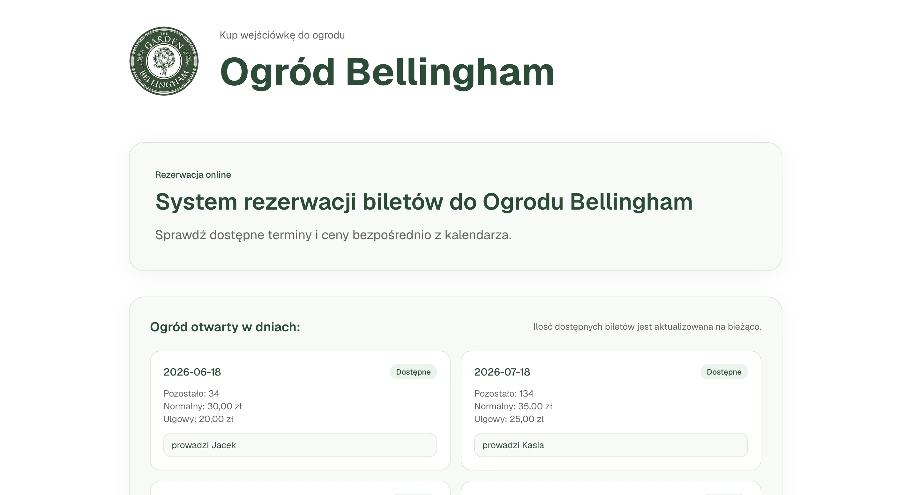
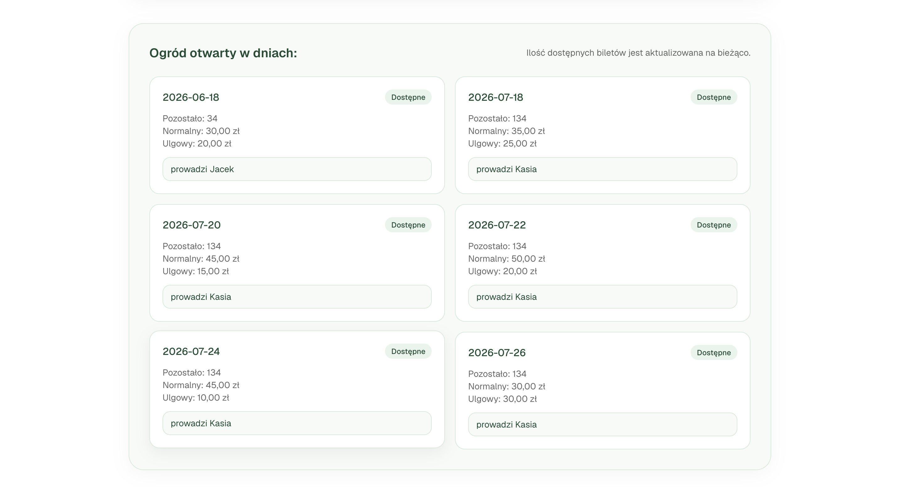
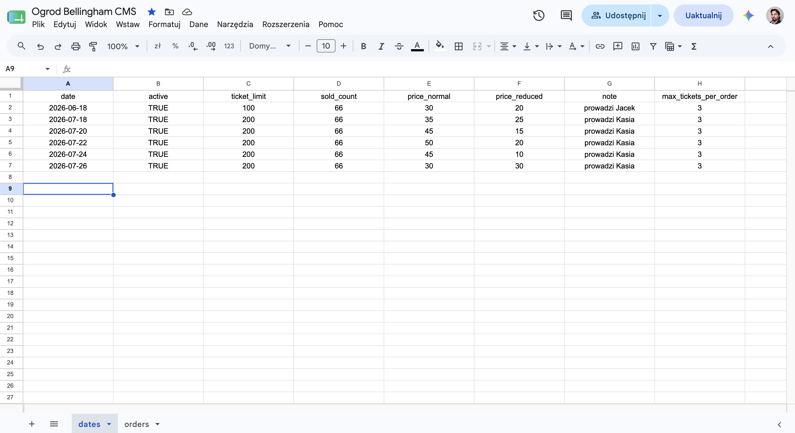

# 🌿 Ogród Bellingham

### Ticket Booking System powered by Google Sheets

A lightweight ticket reservation and availability management system built for Ogród Bellingham.

The application uses Google Sheets as a simple administration panel, allowing non-technical users to manage available dates, ticket limits, and pricing without accessing the codebase.

---

## 📸 Screenshots

### Booking Homepage



---

### Available Dates & Ticket Selection



---

### Google Sheets Administration Panel



---

## ✨ Features

### Visitor Features

* Browse available event dates
* View real-time ticket availability
* Display standard and reduced ticket prices
* Automatic sold-out detection
* Mobile-friendly responsive interface
* Dedicated booking subdomain

### Administration Features

* Manage events directly from Google Sheets
* Update pricing without code changes
* Control ticket limits per event
* Enable or disable event dates
* Add custom visitor notes
* Configure maximum tickets per order

---

## 🛠️ Tech Stack

* Next.js 15
* React
* TypeScript
* Tailwind CSS
* Google Sheets API
* Google Service Account
* Vercel

---

## 📊 Data Structure

The application uses Google Sheets as its primary data source.

Example fields:

| Field                 | Description                    |
| --------------------- | ------------------------------ |
| date                  | Event date                     |
| active                | Event visibility status        |
| ticket_limit          | Maximum available tickets      |
| sold_count            | Number of sold tickets         |
| price_normal          | Standard ticket price          |
| price_reduced         | Reduced ticket price           |
| note                  | Additional visitor information |
| max_tickets_per_order | Purchase limit per order       |

---

## 🔐 Environment Variables

Required variables:

```env
NEXT_PUBLIC_APP_URL=
GOOGLE_SERVICE_ACCOUNT_EMAIL=
GOOGLE_PRIVATE_KEY=
GOOGLE_SHEETS_SPREADSHEET_ID=
```

---

## 🚀 Local Development

Install dependencies:

```bash
npm install
```

Start development server:

```bash
npm run dev
```

Build for production:

```bash
npm run build
```

---

## 🌐 Deployment

Hosted on:

* Vercel
* Google Sheets API

Production URL:

```text
https://bilety.katarzynabellingham.pl
```

---

## 🎯 Project Goal

The goal of this project was to create a simple, maintainable, and cost-effective ticket reservation system without relying on complex third-party booking platforms.

Google Sheets serves as a lightweight CMS, allowing administrators to manage dates, availability, and pricing through a familiar spreadsheet interface.

---

## 👨‍💻 Author

**Michał Polaszczyk**

GitHub:
https://github.com/rockrobin82
